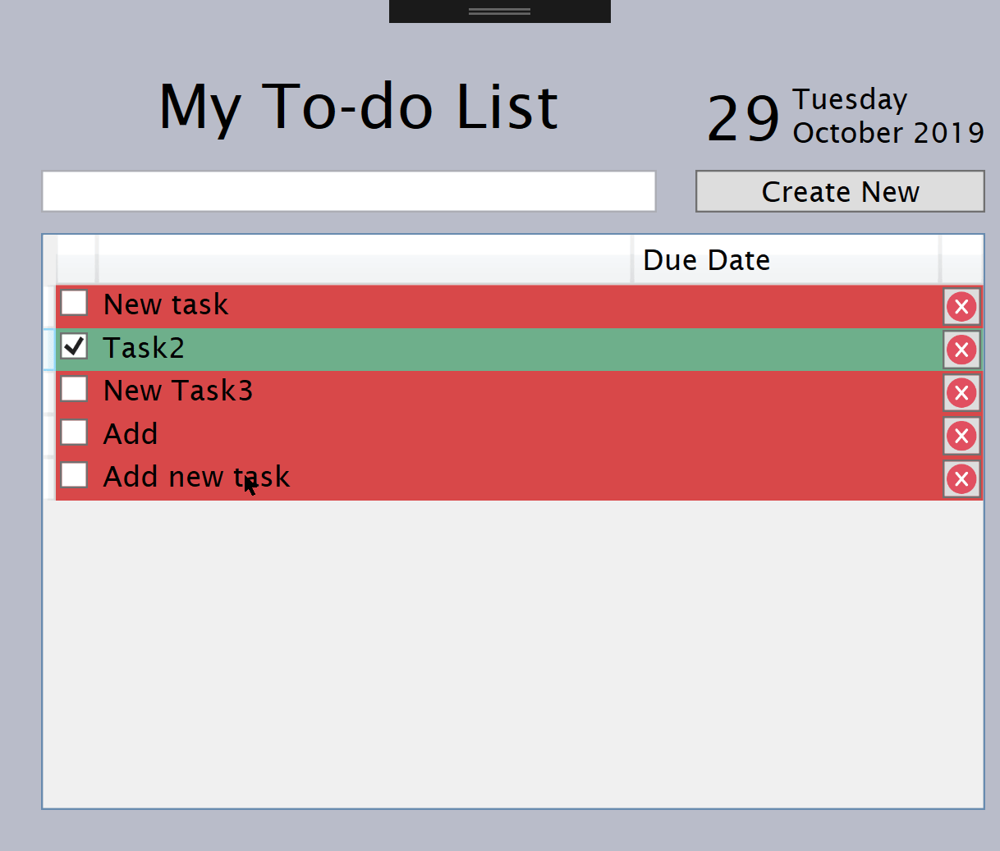
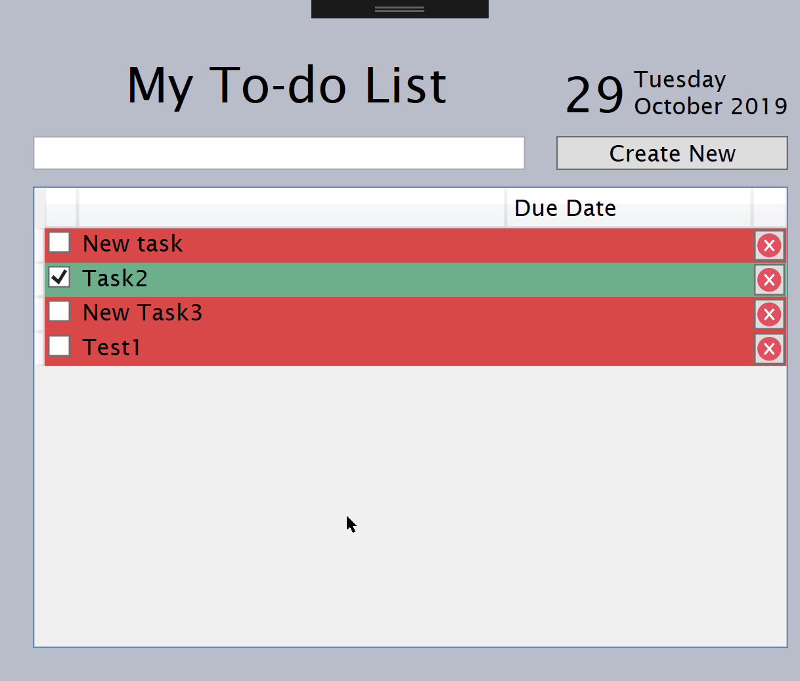
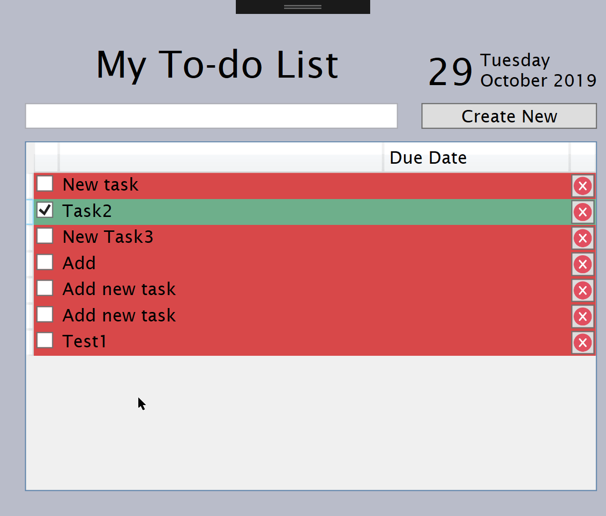

# Task Manager
A Desktop Application to Manage Tasks - Add/Update/Delete

## Note
Data is read and saved as a json object under the bin/Debug folder named "taskmanager.json"

## Take A Peek
</img>

### Add

</img>

### Update

</img>

## Delete

* LANGUAGE: C#
* FRAMEWORK/TOOLS/IDE: VISUAL STUDIO, WPF, CALIBURN.MICRO

## Author

* **Louise Acosta** 
